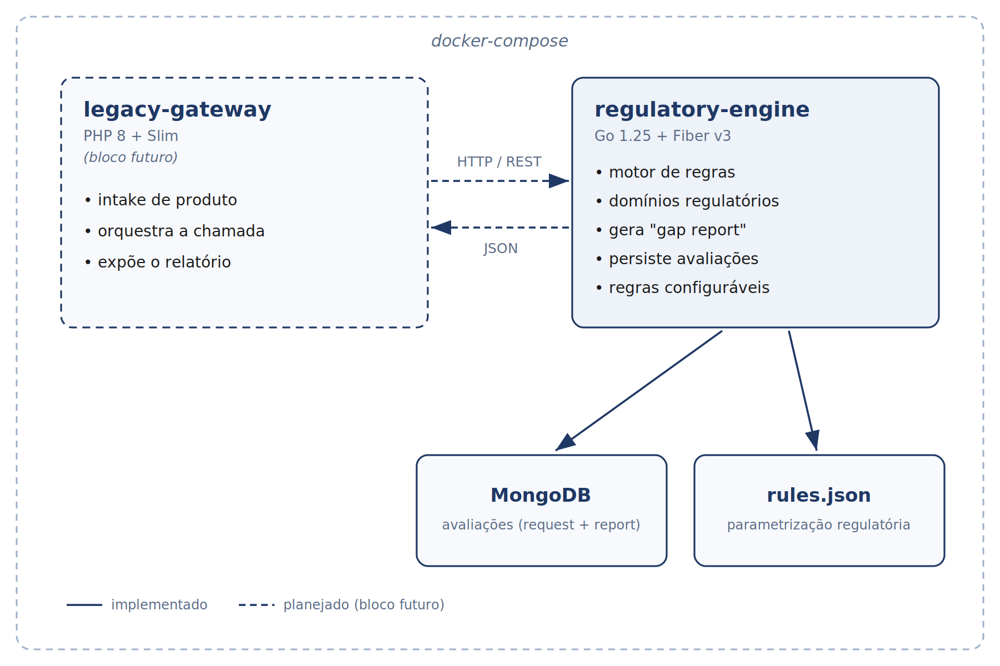

# Regulatory Compliance Engine


Motor de conformidade regulatória para a **tropicalização de serviços financeiros** (EUA → Brasil).

Dado um produto ou operação financeira, o sistema responde a duas perguntas: **pode operar no Brasil?** e **o que precisa ser adaptado?** — aplicando regras regulatórias brasileiras (PLD/COAF, Câmbio/IOF) de forma **configurável**.

> Projeto de portfólio, **fictício e original**. Cenário, dados e regras são ilustrativos e não reproduzem sistemas de nenhuma empresa. Detalhes na [especificação técnica](docs/especificacao_tecnica.md).

## Arquitetura



- **`regulatory-engine`** (Go + Fiber v3): motor de regras e domínios regulatórios.
- **`legacy-gateway`** (PHP + Slim): gateway que representa o sistema legado _(blocos futuros)_.
- **MongoDB**: persistência de submissões e vereditos.

## Stack

Go 1.25 · Fiber v3 · MongoDB · Docker Compose · GitHub Actions. Testes automatizados e CI já implementados; gateway PHP/Slim no roadmap.

## Como rodar

Com **Docker** apenas (sem Go instalado), a stack completa — MongoDB + motor — sobe em containers:

```bash
docker compose up -d --build --wait
```

Ou `make up` / `make down`. A imagem do motor é multi-stage (binário estático sobre distroless, usuário sem privilégio) e leva o `rules.json` embutido.

### Desenvolvimento (hot reload)

Pré-requisitos: **Go 1.25+**, **Docker** e [Air](https://github.com/air-verse/air). Suba só o MongoDB e rode a API localmente — não use junto com `make up`, pois ambos ocupam a porta 3000.

```bash
# sobe o MongoDB (aguarda ficar healthy) e a API com hot reload
make dev
```

Sem `make`, manualmente:

```bash
docker compose up -d --wait mongodb
cd regulatory-engine
go run ./cmd/api
```

Teste o healthcheck:

```bash
curl http://localhost:3000/api/v1/health
# {"service":"regulatory-engine","status":"ok"}
```

## Testes

Suíte de testes unitários e de handler. Não exige MongoDB — os handlers são
testados contra a interface de persistência com um dublê em memória:

```bash
cd regulatory-engine
go test ./...
```

A mesma verificação (`gofmt`, `build`, `vet`, `test`) roda no CI a cada push/PR.

## Endpoints

| Método | Rota | Descrição |
|---|---|---|
| `GET`  | `/api/v1/health`            | Liveness: processo no ar |
| `GET`  | `/api/v1/ready`             | Readiness: `200` se o MongoDB responde, `503` se não |
| `POST` | `/api/v1/evaluate`          | Avalia um produto/operação, **persiste** e retorna a avaliação criada (201) |
| `GET`  | `/api/v1/evaluations`       | Lista as avaliações mais recentes |
| `GET`  | `/api/v1/evaluations/{id}`  | Recupera uma avaliação pelo id |

Exemplo de avaliação:

```bash
curl -X POST http://localhost:3000/api/v1/evaluate \
  -H "Content-Type: application/json" \
  -d '{
        "product":   { "type": "personal_loan", "origin": "US", "origin_currency": "USD" },
        "operation": { "amount": "75000.00", "currency": "USD", "method": "international_transfer",
                       "counterparty": { "name": "John Doe", "pep": false } }
      }'
```

Resposta (`201 Created`) — a avaliação persistida (`id`, `created_at`, `request` e o `report`):

```json
{
  "id": "665f...c3",
  "created_at": "2026-09-23T16:00:00Z",
  "request": { "product": { "...": "..." }, "operation": { "...": "..." } },
  "report": {
    "compliant": false,
    "results": [
    {
      "domain": "IOF",
      "status": "adaptation_required",
      "detail": "Entrada convertida de USD para BRL a 5.00; IOF de 0.38% aplicavel...",
      "calculated_amount": "1425.00",
      "reference": "rule:iof.international_transfer"
    },
    {
      "domain": "PLD_COAF",
      "status": "reportable",
      "detail": "Valor de 375000.00 BRL atinge o teto de comunicacao (50000.00 BRL); operacao reportavel ao COAF.",
      "calculated_amount": "375000.00",
      "reference": "rule:pld.reporting_threshold"
    }
  ],
    "required_adaptations": [
      "Incluir calculo e retencao de IOF no fluxo de entrada.",
      "Gerar comunicacao ao COAF para a operacao."
    ]
  }
}
```

Requisição inválida (campo ausente, valor não positivo ou com mais de 2 casas, tipo/método desconhecido, código de país/moeda fora do padrão ISO, moeda da operação diferente de `USD`) retorna `400` com todos os campos inválidos, e nada é persistido:

```json
{
  "error": "requisicao invalida",
  "details": [{ "field": "operation.amount", "message": "deve ser maior que zero" }]
}
```

As regras completas estão na [especificação técnica](docs/especificacao_tecnica.md#5-contrato-da-api-regulatory-engine).

> Os valores regulatórios (alíquotas, limites, câmbio) vivem em `regulatory-engine/config/rules.json` e são **configuráveis** — mudar a norma não exige recompilar a lógica. O arquivo é validado no boot: parametrização incoerente impede o serviço de subir.

## Estrutura

```
regulatory-compliance-engine/
├── docker-compose.yml        # infraestrutura local (MongoDB)
├── Makefile                  # atalhos de desenvolvimento
├── docs/                     # especificação e diagramas
└── regulatory-engine/        # motor de regras (Go)
    ├── cmd/api/              # ponto de entrada
    ├── config/rules.json     # parametrização regulatória (alíquotas, limites, câmbio)
    └── internal/
        ├── config/           # configuração via ambiente
        ├── database/         # conexão com o MongoDB
        ├── model/            # structs do domínio (contrato)
        ├── money/            # tipo monetário (decimal, sempre 2 casas)
        ├── engine/           # interface Rule + avaliador
        ├── rules/            # regras (ex.: IOF) + carregamento do rules.json
        └── httpapi/          # servidor, rotas e handlers HTTP
```

## Status

Motor funcional com testes automatizados e CI verde, construído em **blocos incrementais**. Veja a [especificação técnica](docs/especificacao_tecnica.md) para o escopo completo e as próximas etapas.

## Roadmap

- **Gateway PHP + Slim** — serviço legado que consome o motor Go (integração legado ↔ novo).
- **Identidade de contraparte (`parties`)** — promover a contraparte a entidade própria, identificada por documento (CPF/CNPJ), com *entity resolution* para screening.
- **Novos domínios** — Limites Bacen/Pix, LGPD, SCR.
- **Regras versionadas em banco** — histórico de vigência das normas.
- **Testes de integração** — repositório testado contra MongoDB real (testcontainers).

Detalhes na [especificação técnica](docs/especificacao_tecnica.md#9-roadmap-evolução-futura).
